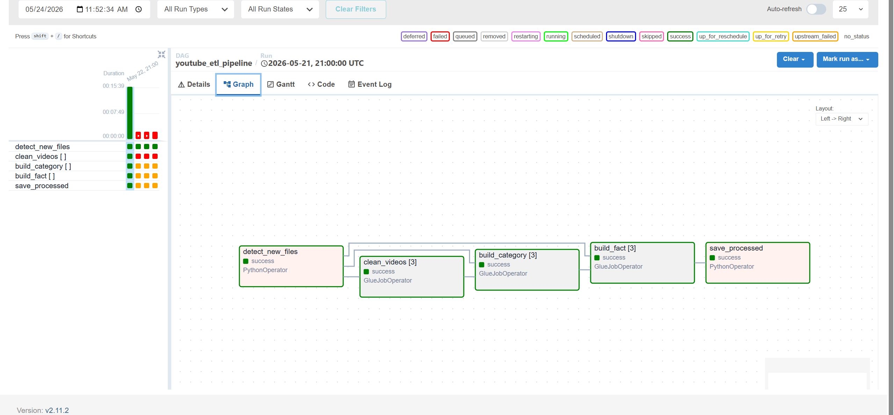
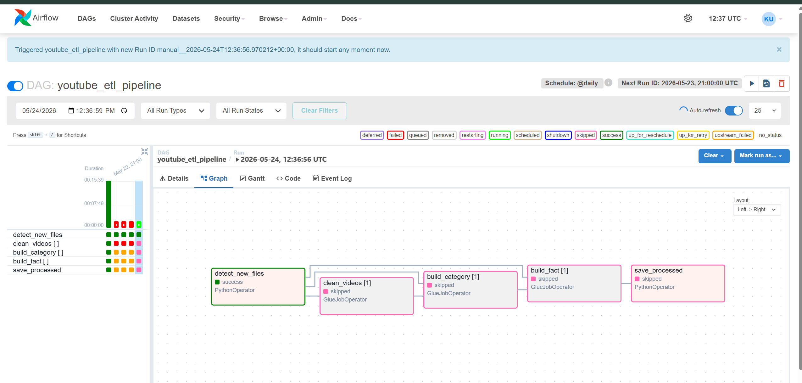

# YouTube AWS ETL Pipeline

End-to-end cloud ETL pipeline built for processing and analyzing YouTube trending video data using AWS services, Apache Airflow orchestration, Spark transformations, Athena analytics, and Power BI visualization.

This project was designed with a focus on scalability, efficiency, and incremental data processing rather than simply executing full ETL jobs repeatedly.

---

## Project Goal

The objective of this project is to build a scalable data pipeline that can:

* Detect new incoming data automatically
* Process only newly arrived files
* Prevent duplicate records from entering the warehouse
* Avoid unnecessary ETL execution
* Reduce processing overhead and cloud resource consumption
* Support future data growth with minimal modifications

---

## Technologies Used

### Cloud Services

* Amazon S3 (Data Lake Storage)
* AWS Glue ETL Jobs
* AWS Glue Crawlers
* AWS Glue Data Catalog
* AWS Athena

### Data Processing

* Apache Spark
* Python
* SQL

### Orchestration

* Apache Airflow running on a Virtual Machine (EC2)

### Visualization

* Power BI

---

## Architecture Overview

Pipeline flow:

Raw Data → S3 Raw Zone → Glue ETL → Staging Layer → Warehouse Layer → Athena → Power BI

S3 Bucket Structure:

```text
youtube-etl-project/

├── raw/
│   ├── videos/
│   └── categories/
│
├── staging/
│   ├── videos/
│
├── warehouse/
│   ├── fact_trending_videos/
│   └── dim_category/
│
├── metadata/
│
└── athena-results/
```

---

## Airflow Workflow

The pipeline uses Apache Airflow DAG orchestration running on a virtual machine.

Pipeline tasks:

1. Detect new files
2. Clean video data
3. Build category dimension
4. Build fact table
5. Save processed files metadata

Successful workflow execution:



Skipped workflow when no new files are detected:



---

## Incremental Processing Logic

A major focus of this project was avoiding full reprocessing.

Instead of running ETL jobs on all files every time:

* The pipeline detects newly arrived files automatically
* Previously processed files are tracked
* Only newly detected files are processed

This significantly improves efficiency and reduces unnecessary computation.

---

## File Detection Using ETag

The project uses Amazon S3 ETag values for file identification.

The pipeline stores processed file information inside a metadata file.

Processing behavior:

### Case 1 — No new file arrives

If Airflow runs and no new file is detected:

* ETL jobs are skipped automatically
* No resources are wasted
* No unnecessary Glue execution occurs

### Case 2 — New file arrives

If a completely new file arrives:

* File ETag is compared against processed files
* Only that new file is processed
* Existing files remain untouched

### Case 3 — Same filename but updated content

If a file arrives with the same filename but updated content:

* Amazon S3 generates a new ETag value
* The pipeline identifies the file as modified
* The updated file is sent for processing

However, the pipeline does **not** blindly append the entire file into the warehouse.

Before loading data:

* Incoming records are compared against existing records in the fact table for the same country
* Previously processed rows are identified
* Only genuinely new rows are appended
* Existing records remain unchanged

This ensures:

* No duplicate records are inserted
* Historical data remains consistent
* Reprocessing costs are minimized
* Only incremental changes are loaded into the warehouse

Example:

Suppose `US_youtube_trending_data.csv` already exists and contains 10,000 records.

Later, another file arrives with the same filename but a different ETag and now contains:

* 10,000 existing rows
* 500 newly added rows

The pipeline will not load all 10,500 rows again.

Instead:

* Existing 10,000 records are ignored
* Only the additional 500 new records are appended to the fact table


---

## Duplicate Prevention Strategy

The pipeline was designed to avoid duplicate records inside the warehouse fact table.

When updated files are processed:

* Existing records for that country are compared against incoming records
* Only new rows are appended
* Previously loaded records remain unchanged

This guarantees:

* No duplicate records
* Clean fact tables
* Consistent analytics results

---

## Scalability Benefits

This approach makes the architecture scalable because:

* ETL processing grows only with new data
* Full historical data is not repeatedly processed
* Processing costs remain lower
* Pipeline execution time remains efficient
* Future countries and datasets can be added with minimal changes

---

## AWS Glue ETL Jobs

### clean_videos_job

Responsibilities:

* Read raw CSV files
* Validate data
* Clean records
* Convert data types
* Store transformed parquet data

---

### build_category_dimension

Responsibilities:

* Read category JSON files
* Create category dimension table

---

### build_fact_trending

Responsibilities:

* Build fact table

* Create calculated metrics:

* engagement_rate

* like_ratio

* trending_days

---

## Athena Analytics

Business questions answered:

* Top channels by deduplicated views
* Trending duration by category
* Duplicate detection validation
* Country level analysis
* Video engagement analysis

Example query results are available in the screenshots folder.

---

## Power BI Dashboard

Dashboard includes:

* Trending analysis
* Country comparisons
* Category performance
* Engagement metrics
* Channel analysis
* Video performance KPIs

Power BI dashboard file can be downloaded from Google drive (due to github size restrictions)
https://drive.google.com/file/d/1W4e12kv5XtN9jMiCXsCC2jjWD35CG-2d/view?usp=sharing

---

## Dataset

Dataset excluded from repository due to file size.

Download:

https://www.kaggle.com/datasets/rsrishav/youtube-trending-video-dataset

Place files inside:

```text
data/raw/
```

---

## Author

Kamal Nafea
